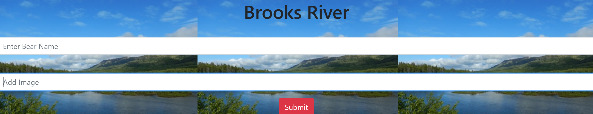

# bear-watcher
## Description
 This project was creating modules using the script type "module". We used import and export functions to create the domStrings. On this lesson we learned how to create javascript components and add the modules. We also learned how to create helpers and importing the data with getter and setter methods.
## screenshots

## How to run
1. Clone down this repo
1. Make sure you have http-server installed via npm. If not get it [HERE] (https://www.npmjs.com/package/http-server)
1. On your command line run `hs -p 9999`
1. In your browser go to `http:/